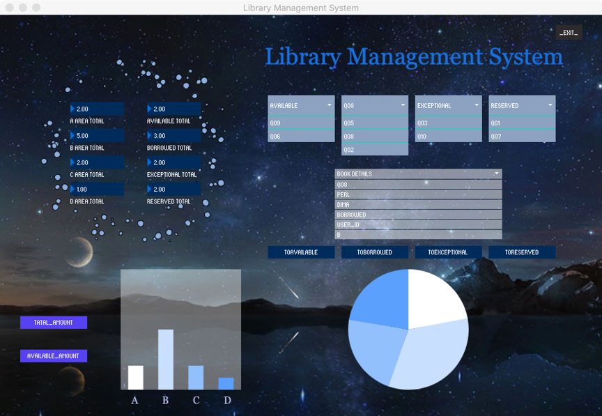

# System Design

**Contents**

- [Architecture of the entire system](#architecture-of-the-entire-system)
- [The design of 3 key systems](#the-design-of-3-key-systems)
- [User stories](#user-stories)
- [The evolution of Wireframes](#the-evolution-of-UI-wireframes)
- [Communication Protocols](#communication-protocols)
- [Data persistence mechanisms](#data-persistence-mechanisms)
- [Web Technologies](#web-technologies)


## Architecture of the entire system  


The main purpose of the project is to build a simple library management system with user query and reservation functions. Similarly, librarians can update the status of books in real time and notify users that books can now be borrowed.

The following are the roles played by each role in this system:

First, users can register an account, then log in, and then check the status of books or book reservations on the web page. Librarians can scan the code in the book through m5stack to receive messages from the administrator, and finally return the book to the correct shelf or notify the user who has booked the book. Administrators can respond to queries from users, send messages to M5stack, and use various functions of the library management system interface to display information such as book status and inventory. Web page, M5stack, desktop connection and send query or response through MQTT.

One day, Jack came to the library to borrow the book "Learning Java". When he logged into the web user interface and checked the book list, he found that the book had been borrowed, so he filled out the form and sent the book Order. A few days later, when the librarian scanned the books in the book return box and found that the book "Learning Java" had been booked, he send a message by M5stack to inform Jack that the book he had ordered had returned to the library.
    
## The design of 3 key systems
###   Desktop Application

The desktop application of the library management system is for the library administrator, and is mainly used for the management of the library book status and the visualization of the book status. The page mainly includes four parts: an overview of books in the upper left corner, a list of book status classifications in the upper right corner, a detailed display of books in the middle right corner, and a book classification table at the bottom.

The library includes four areas: A / B / C / D. 
There are four states in the book: 
* available (currently available in the library), 
* borrowed (already borrowed), 
* exceptional (already returned but not placed in a suitable location), 
* reserved (already reserved)



#### 1. Overview of books

The display of the book overview is divided into two categories. On the left is the display of the number of books (divided according to the four areas of the library), on the right is the display of the number of books (the current status of the four books is divided). When the book status changes (new book storage or book status changes), this part can display the latest issue quantity in real time.


 
#### 2. Book status classification list

According to books available, borrowed, exceptional, reserved four categories of status display, click on the list to display all the book ID under a certain status. When the state of the book changes, this part can show the latest distribution in real-time.


    
#### 3. Book details display
This section is used in conjunction with the book status classification list. Click the ID of one of the books in the list to display detailed information about the book, including:
Book_id, book_name, author_name, book_status, booker id, area, location, last_borrowed_time, last_return_time and last_warehouse-in_time ten parts.

Book details are displayed. Using the four buttons below (TOAVALIBLE, TOBORROWED, TOEXCEPTIONAL, TORESERVED), you can change the status of the currently displayed book. At the same time, the two parts of the book overview and the book status classification list will be updated simultaneously.


In addition, by clicking the button, the corresponding time field of the book will also be changed.
* Click TOAVALIBLE, the last_warehouse-in_time field of the current book is automatically changed to the current time;
* Click TOBORROWED, the last_borrowed_time field of the current book is automatically changed to the current time;
* Click TOEXCEPTIONAL, the last_return_time field of the current book is automatically changed to the current time;

#### 4. Book classification chart

The book classification chart is divided into left and right parts. The left shows the distribution of books in four different areas of the library, and the right shows the distribution of books in four different states.


The left part shows the total number of books in the four areas by default. If you click AVALIABLE_AMOUNT, it will switch to the number of books that can be lent out in the four areas. If you click TATAL_AMOUNT, it will return the total number of books in the area.


In addition to the functions mentioned above that can be directly seen, the desktop application of the library management system can communicate with the web page and M5Stack at the same time. After receiving the query or reservation information from the web page, it can automatically update and return the book information. After receiving the query information of M5Stack, it can also automatically update and return the book information.
    
### M5stack

After m5stack is turned on, it will be able to:
(1)	display the theme and LOGO
(2)	connect to Wi-Fi and MQTT
(3)	scan the barcode of book
(4)	send book id to MQTT & receive the message from the desktop by MQTT
(5)	display the book information
(6)	decide whether to send the reminder according to the status of the book


#### 1. Display the theme and LOGO


The theme and logo are dynamically displayed on the screen through the use of delay function.

#### 2. Connect to Wi-Fi and MQTT


The codes to complete the work of connecting Wi-Fi (UoB Guest) and MQTT are based on the template. When communicating with desktop via MQTT, the topic for sending query information is "M5_query", and the topic for obtaining detailed book information is "response_to_M5". When communicating with the web, the topic for sending the notification is "booked_reminder".

#### 3. Scan the barcode of book


Assuming that m5stack has a camera, the book_id of the book will be obtained after pressing the scan key. By passing the id to MQTT, the desktop is queried for information about this book. User can cancel this scan by pressing cancel key.

#### 4. Send book id to MQTT & receive the message from the desktop by MQTT


If the connection is successful, the screen will look like the left picture, and if it fails, it will look like the right picture.
M5stack sends book_id in the form of "book_id": "012" to MQTT with the topic "M5_query", and get the message in form of json with topic "response_to_M5".

```
void splitAndPrintBookInfo(char input[])
{
  char* bookId;
  char* booked;
  char* positions;
  char delimiter[] = ",";
  char* ptr = strtok(input, delimiter);

  while(ptr != NULL)
  {
    String temp = String(ptr);
    if(temp.indexOf("book_id") >= 0)
    {
      bookId = ptr;
    }
    else if(temp.indexOf("booked") >= 0)
    {
      booked = ptr;
    }
    else if(temp.indexOf("position") >= 0)
    {
      positions = ptr;
    }
    ptr = strtok(NULL, delimiter);
  }

  printBookInfo(bookId, booked, positions);
}
```

After obtaining the message, this function will search for "book_id", "booked", and "position" in the string, and take them out and store them in the variables to process print function.

#### 5. Display the book information


Divide the processed information into "book_id", "booked", and "position", and display them on the screen, waiting for the next processing: send out a reminder or scan the next book.

#### 6. Decide whether to send the reminder according to the status of the book

If the "booked" column shows "user_id" instead of "null", the notification will be sent to the user (through MQTT with topic "user_id") after pressing the send key.

### Web application

Our responsive web application is mainly designed for students who want to query the information of books in a certain library and make their reservation instantly. Also, the user can receive the notification from the librarian (M5stack) directly when the book returns to the library immediately. The following picture is the landing page.


The website provides three parts:
(1) Login and Registeration 
(2) Query and Reserve books
(3) Notifications

#### 1. Login and Registration
In order to enter the library management system conveniently, the users have to login their account or register a new account.


#### 2.	Query and Reserve books
In this page, the users can search and reserve books via MQTT communicating with the desktop. The topic for sending query request is “WEB_query ", and " response_to_WEB " is the topic for acquiring detailed information.

By clicking the “Query” button, the user can search a book with either the book name or the author name. At the same time, web application sends the JSON message to the desktop server via MQTT and receives certain book relative information. The received message is parsed and displayed on the web page for the users. 

At our original setting, since the communication between web application and desktop server is continuously, the user can resend the queries and know the newest information of the books.

However, in order to reduce the repetitive  and also decrease the storage memory and data processing time on the website, instead of saving the parsed query results, we define an object called “bookObj” to store the current parsed book information temperately. After that, the user can click the “Booking” button to submit the message to the desktop for making the reservation.


#### 3.	Notifications
In this page, the user can easily check their reservation and receive the reminder from M5stack. The table of “MyAccount” displays "Query_ID", "Book name", "Book status", "Book position", and “Notification” for each booking order. 

If the reserved book is changed the status from 'Borrowed' to 'Available' (that means when the book return to the library), then the web receive the JSON message from M5stack and send a notification to the user. Each user has their own topic with their "user_id", the M5stack would send the notification to remind the user via MQTT when the book is available.


   
## User stories
### Desktop
The desktop allows the administers to manage the status of books and update the details when the book status is changed. Following are the example of user stories:

When An administrator received a reserved book request, he can find the location and status of a certain book and pass the information to the librarian. Once the status of a borrowed and returned book is changed, they can update the information so that the status can be shown to librarian and students.


### M5stack

The librarian uses M5stack to scan a book placed in the return box, and after inquiries, gets information about the book. The "book_id" of this book is "Q10", "booked" is "null", and "position" is "B-1-C-2", so he put the book back to Zone B Bookshelf 1 Block C Floor 2. Next, he scanned another book and found that the "booked" of this book was "A1234". So, he pressed the send button to notify user A123 that the book he had booked had returned to the library.

### Web
The network system is designed to enable students to query and receive information from the library immediately when they want to borrow and book books. The following are examples of user stories:

When students want to find a book, they can use their student account to log in to the library management system. After searching for books with the information they know, the status of the books will be displayed in the search results. If the book is available in the system, they can make an appointment directly in the system, and then the librarians can collect their book. If the book is not in the system, they can choose to keep it, waiting for the system to notify them to collect the book.

   
## The evolution of UI Wireframes

1. In the following part of the page design, the original design does not include the TORESERVED button. Only after the user makes a reservation on the web page, the book status may be changed to reserved. However, the user reflects that if a user is already in the library, it is currently inconvenient Using the web page to log in to book, it should also be possible for the administrator to book directly on this page and increase the user id.


2. When designing this part, the button function was not added at the beginning, but the two pictures were directly displayed. After the user suggested, adding the button can increase the user interaction and make the page more concise. current state.


3. After the actual operation of m5stack, it was found that the yellow words had better visual effects on the black screen. At the same time, it is more convenient for users to mark the description of the function on each button and make it change colour after clicking.


4. At the time started to design our website, we tried to build a new website which can transfer every input information to JSON format. After that, we used Bootstrap 4 components to improve the web page and make it look fancier.


5.  The user information, the query page and the order list were not separated in the original page design of the web application as the following picture. However, we found that it is more convenient for the system management that dividing these functions into different parts. Also, it is simpler for potential investors to comprehend our projects.

   
## Communication Protocols
We use MQTT as our communication protocol because MQTT is a machine-to-machine (M2M)/"Internet of Things"  connectivity protocol. It was designed as an extremely lightweight publish/subscribe messaging transport. It is useful for connections with remote locations where a small code footprint is required and/or network bandwidth is at a premium. 

Our system requires multiple communications in different directions between different devices. Due to the sophisticated communication design of our system, we decided to use multiple different subscriptions in order to  publish which messages to which application clearly as the following form:


### (a) Desktop <——> web
**Web  —— query ——> Desktop** 

*Topic: "WEB_query"*
There are three different conditions when a user query a book information from desktop.
1. only use book_name to query;
2. only use author_name to query;
3. use book_name and author_name to query, e.g:
```
{
  "query_id": "00000001",
  "user_id": "stu190001",
  "book_name": "java",
  "author_name": "Andrew",
  "book_status": "null"
}
```

**Web  —— booking ——> Desktop** 

*Topic: "WEB_query"*
The booking request must include book_name and author_name, and the book_status would change to “booking”.
```
{
  "query_id": "00000001",
  "user_id": "stu190001",
  "book_name": "java",
  "author_name": "Andrew",
  "book_status": "booking"
}
```

**Desktop ——query_response——> web** 

*Topic: "response_to_WEB"*
If desktop could find the corresponding book, it would send the information to the web:


Otherwise, the desktop would send { "book_name": "null" } to the web.

**Desktop ——booking_response——> web** 

*Topic: "response_to_WEB"*
If desktop could find the corresponding book, it would change the "book_status" to "booked" and set the value of “booked” is "user_id", then send the updating information to the web.

### (b) Desktop <——> M5 stack
**M5 stack —— query ——> Desktop** 

*Topic: "M5_query"*
M5 stack using book_id to query the information of the book.

**Desktop ——response——> M5 stack** 

*Topic: "topic："response_to_M5""*
M5 stack using book_id to query the information of the book.


Otherwise, the desktop would send { "book_id": "null" } to the M5 stack.

### (c) M5 stack ——> Web

If the booked field in the desktop reply message received by M5 stack after scanning a book is not empty, M5 stack would send a prompt message with the topic of the current user_id to the Wed (a user). The user receives the reminder and knows he can go to borrow the book now.
   
## Data persistence mechanisms
This design is lightweight , so the database is not used, and the JSON file is used to maintain the book information. The JSON file of each book is as follows:


```
"book_id": "Q04", —— Book label, starting with Q;
"book_name": "C", —— Book name
"author_name": "Neill", —— book author
"book_status": "available", —— book status
"booked": "stu190001", —— If the book is booked, the id of the booked user is displayed, otherwise null
"area": "D", —— Area where the book is located
"position": "D-1-C-2", —— The specific position of the book
"last_borrowed_time": "2020-05-07", —— the time the book was last borrowed
 "last_return_time": "2020-05-01", —— the time the book was last returned
 "last_warehouse-in_time": "2020-05-07"-the time when the book was last put back in a fixed position
```
When you receive the reservation information on the web side, the update information on the M5 stack side, and the button operation on the desktop page, you can automatically update the corresponding fields of the json file.

   
## Web Technologies

Web application of our entire system is used to be the main user interface. 

### Client

The main languages of our website are HTML5, CSS3 and JavaScript. The above three are the basic programming languages for web design. Also, in order to build a static website rapidly, we use the prebuilt web components and structures in the Bootstrap 4 as the framework for our web development, such as navigation bars, tables and the cards.

### server
Node.js is used to build the webserver of our website. It is a famous web app development based on Chrome’s V8 JavaScript engine. The reason why we choose it is we used MQTT to deal with the main part of our data and simplify the whole project, so Node.js and ExpressJS applications meet our request of a simple web server. 

## Summary

Taking into account the feedback from the volunteers in the initial test, we decided that our system will contain three subsystems-the desktop. The desktop is responsible for processing all requests from the other two subsystems. In addition, the website is mainly used for IoT devices (M5Stack) that send requests and get feedback, and it acts as a bridge between the other two subsystems.

In general, all communications between these three subsystems are designed based on "book information" objects, and these objects are sent to different subsystems to implement the operation of the entire library management system. In addition, the information transmission process relies on the MQTT protocol to send JSON objects to each subsystem.


