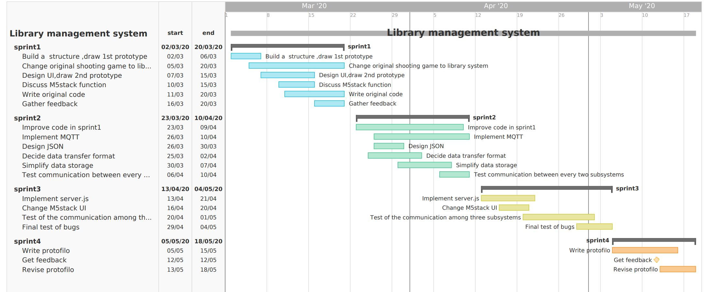
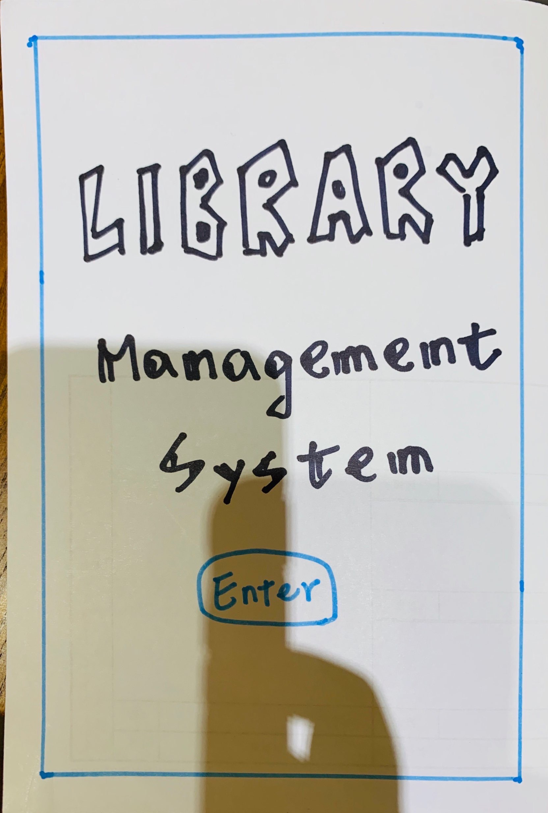
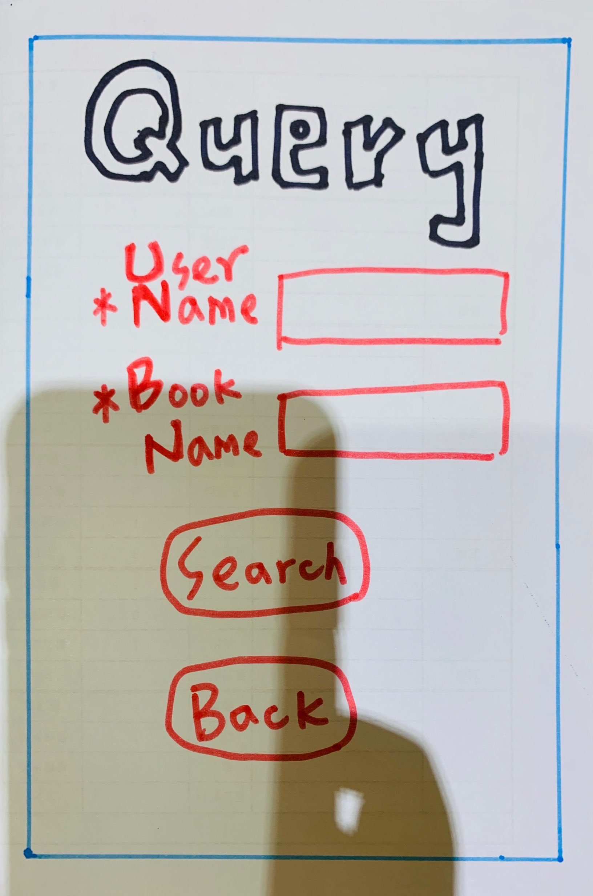
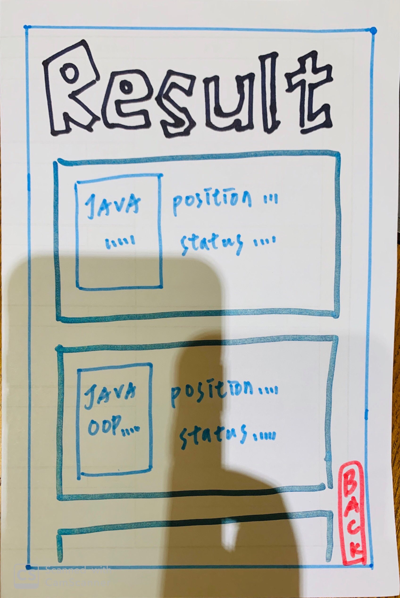

# System Implementation

**contents**
- [Breakdown of project into sprints](#breakdown-of-project-into-sprints)
- [Evaluation designs](#evaluation-designs)
- [Social and Ethical Implications](#social-and-ethical-implications)

## Breakdown of project into sprints

                                           overview of our project timeline.

### Sprint1

In sprint1, Initially, the team members planned to design a small shooting game, and went through a series of UI design and user experiments. However, due to insufficient consideration in the end, the game is difficult to connect the web side, desktop side and M5 Stack side, so consider replacing it with the current library management system(Including web, desktop and M5 Stack). The design of the library management system is as follows: our group create an original idea about the whole library system, design the UI of each system, draw a paper prototype to help to develop the following several sprints. At this stage, we achieve several goals:

- Target the users’ requirements and build a clear structure and function of the system.
(The system function is initially determined to help students query the information and status of books in the library, so that book reservations can be made more intelligently, reduce student borrowing time, and improve the efficiency of borrowing books.)
- Reach a consensus on the basic UI, design our logo and create our version1 paper prototypes. Discuss the first version user story.

#### User Stories
When students want to find a book, they can use the UI via using the title or the author of the book as key word and clicking the “Query” button, the information of the books will be displayed in the website.

- Gather the feedback from volunteers based on the Wizard of Oz techniques to improve our UI and create our version2 prototypes
- Discuss which system the M5stack can be applied in to make sure the system can work efficiently.

Sprint1 was largely focused on abstract design. The design of the original shooting game actually took us a lot of time and energy. When we learned that it could not meet the final needs, we modified the plan as quickly as possible, proposed several feasible plans, and finally determined the design after consulting the teacher. The book management system. We decide the purpose of our system is helping students who have difficulties in looking for the details and location of books quicker. The structure was built, but there are little specific functions added to the framework. After inviting the volunteers who are unfamiliar with our system to test whether our idea is feasible, we had a group meeting to improve the UI by adding a sign-up function and auto notifying function to the web. Meanwhile, we design a logo “glasses” as our logo on M5stack to make our product more impressive. Considering that it is unrealistic for each student to hold an M5 stack and the administrators can complete their task only by computer, we came to the decision that librarian is the best choice to hold the M5stack so that they can scan the barcode of each book. Students only need to log in to the web page we designed through their laptop or mobile phone to view the book information and view the status of the book. When the book status is available, you can book the book.

### Sprint2

After solving the basic design and functional problem, in sprint2, our group concentrated on the implementation of the communication circle between 3 systems. 

#### User Stories
The user uses website to send the query and booking request to the desktop server. At the same time, the server sends the book information back to the website and makes the reservation. An administrator manages all book’s information in the library, once the status of a borrowed and returned book is changed, he would update the information so that the status can be shown to librarian and students. The librarian uses M5stack to scan a book in the return box. After sending query request to the desktop server, he would get the information especially book’s position and the reservation status. If the book has been reserved, the librarian can press the button to notify user. 

At this stage, we achieved the following goals:

- Decide MQTT as our communication protocol of each section
- Design json file content for three-way communication
- Decide the detailed data and the direction of data transferring via MQTT
- Test and simplify the form of data transferring and storage
- Conduct communication experiments between pairs

Sprint2 mainly focused on solving the communication bug and optimize the logical system settled in sprint1. At this stage, our team members held several online meetings, and discussed, modified, and optimized the system implementation details and communication requirements. For the Desktop system, according to the volunteer's experience, it is vital to store the data which represents location, changing book status and the statistic of available/unavailable books. In addition, it is recommended to modify the layout of the entire page to make it more concise, clear and beautiful. Our initial transfer plan between web and desktop is using one more JSON item to represent the book status (reserved or not), after testing, we simplify this process to add this information in user ID in order to improve the efficiency. Apart from that, we tried to solve this problem by passing the "null" information. The web application could send the empty string directly instead of "null", and the desktop side could simply use it in the JSON message.

After this, in the communication between the desktop and the M5 Stack, the original design was that the desktop pushed the entire json file of the book to the M5 Stack. Then the M5 Stack side extracts the required fields. However, after actual testing, it was found that the number of fields accepted by the M5 Stack is limited and it cannot receive the complete json file. Therefore, the content of the file sent by the desktop is simplified, and only the fields required by the M5 Stack are extracted to form a new json file and sent.

Regarding the data storage part, it was originally designed to use a database for storage. Later, in order to simplify the system design, it was decided to store the json file directly. Each book is a json file, including all the information of the book. After receiving information from the web and M5 Stack and its own operations, the desktop side modifies and maintains the corresponding json file.

### Sprint3

In sprint3, our group optimized and integrated the final version of 3 systems; also, the UI was slightly changed according to the volunteer‘s advice. At this stage we achieved following goals:

- Implement server.js
- Change the colour of book information display on M5stack to make it elegant(Three-terminal system communication experiment)
- Final test without bugs

As we mentioned in the web applications part, we used Node.js to build a local web server and use the port 3000 as our localhost. After implementing server.js, most works of our system were completed, then three subsystems were used by three different volunteers to observe whether the whole system could work as we expected. We collected the feedback and decided to make a slight change on M5stack display. We use red box represents book id, the blue box represents booked person id，green box represents book position, instead of three white boxes. With our final test running without bugs, the library management system is finished.

During the final three-party communication experiment, all three terminals found that the local end would receive the information sent to others and the useless information communicated by the other two parties. For example, when the desktop communicates with the network, the M5 terminal will also receive the corresponding message. After research and discussion, we set the topics of sending and receiving to different topics, and the topics of communication between the two pairs are also different, thus solving the problem.
    

## Evaluation designs
The first evaluation technique was Wizard of Oz, which we conducted during workshops. This technique enabled us to observe how users would interact with this product by using role-playing. This helped us gather feedback and reaction easily and quickly so that we can apply this information to improve our paper prototype. The role players pointed out several shortcomings of our initial product model, which provide us with a wide range of ideas to perfect our structure. However, all the participants are peers, and the feedback can be affected by personal emotion, which means they may be more tolerable to some of our disadvantages compared to strangers.

We also turn to our tutors for advice when creating our system idea, using their comment toward our system as one of the criteria to judge our product. Unlike peer's review, tutors' advice tends to be more professional, which save us amount of time in Solving some severe problems. For example, we initially proposed to build a database to store book information, but the teacher does not recommend the idea of building a database. He thinks this will disperse a lot of our energy. We should focus on the cooperation and integration of the three parties.

Nevertheless, this kind of suggestions only gave us the direction to modify our system, and if we want to more specific details, we must combine with more users' feedback. Obtaining information, and finally decided to store a book as a json document, directly maintain the json document of each book. This not only facilitates data transmission, but can also be easily converted to a database for deployment in real scenarios.

On account of the factors mentioned above, user testing is necessary for the improvement of our product. Depend on the samples we gather at the beginning of our project, and we worked well to build the original system. Nevertheless, due to the lockdown in March, we were unable to collect more subjects and forced to develop our rest part of the system based on the previous data. Though our flatmates were willing to help us to test the system, the feedbacks were still limited. 

## Social and Ethical Implications
As for the ethic of our project research, we referred to the ethic form offered by the university to make sure our study is not against the guideline. Before the research, there would be an initial explanation of the study and an opportunity to ask questions. After that, the participants would be asked for consent. If they had any questions during our research, we would answer them until they figured out.
There are no potential risks to our participant during all procedures. We would not ask for their personal information so their privacy would be protected. The device used in research is M5stack, smartphone and desktop, which would not be harmful to people’s physical and psychological health.
In terms of personal feedback and reaction, all information will be recorded confidentially and only be used in a research report. 

Though our product is not fully finished yet, the data of student account and the book they borrow should be protected considering future development. We could add a statement before the user sign up that we would only use their account information in the library system and the details of their personal information can only be stored by the university and the user have opportunity whether to give the consent to our system.

In terms of social issues, our product aims to help the student find books more efficiently and avoid them wasting more time to find the location of the book among hundreds of bookshelves. It is designed based on the university library system, which means even though some students do not use our product, the system would still provide the information they need. Besides, even the books are not borrowed via our system, the book status in the administrator database can also be updated instantly, so there would not be a conflict that two students reserve the same book. 

## Summary

As mentioned above, we divided our project into several parts in different period and set goals for ourselves to ensure our schedule. The sprints 2&3 were really tough work for us, but we tried to figure out all the problems and test all the systems over and over again to maintain our project stable. It was the suitable division of the project that reduced the time we spent in each section.

In this section，it is quite important that we kept in touch with each other closely and instantly so that we could work out some problems efficiently.  Also, the technique (wizard of Oz) we were taught in class along with the tutor and volunteers’ advices assist us in different aspect. As for the Social and Ethical issues, we just thought about limited situations which can cause hidden troubles, so more situations would be found in future evaluation. 

