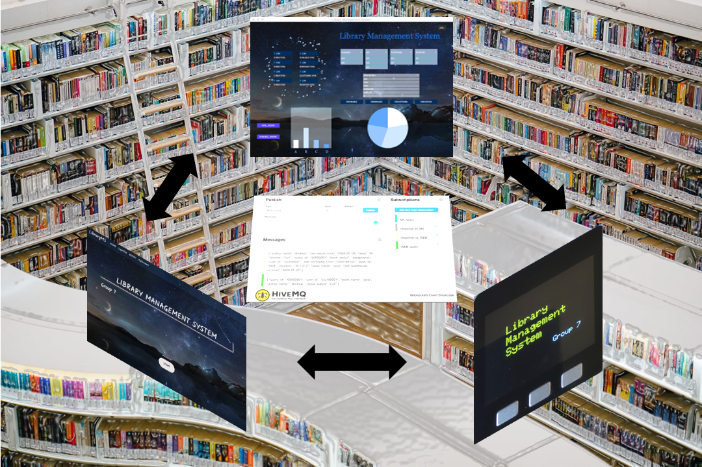

# **Library Management System**

Do you ever wanted to find a book but it is always unavailable?

Do you ever lost in hundreds of book shelves and found the book never in the correct position?

Using our library management system can enable you to get instant notice when the book you need is available, and you do not need to find books shelf by shelf because the librarian will do it for you. This system can accept users’ query and reservation, pass them to the librarian and admin, then the user can be notified once the book is available. Librarian and administrator can also simply the management of data by using this system.

## Team member :
- Kuan ting Huang: ds19001@bristol.ac.uk
- Li Zhang: vf19496@bristol.ac.uk
- Min Lin: xe19102@bristol.ac.uk
- Peiju Pan: qo19500@bristol.ac.uk
- Yazhuo Li：mo19348@bristol.ac.uk
- Yundong Shen: nc19964@bristol.ac.uk

## Portfolio
  1. [System Design](https://github.com/lily-Zhang1/Group_Project/blob/master/Portfolio/System%20Design.md)
  2. [System implemention](https://github.com/lily-Zhang1/Group_Project/blob/master/Portfolio/System%20Implementation.md)
  3. [Project Evaluation](https://github.com/lily-Zhang1/Group_Project/blob/master/Portfolio/Project%20Evaluation.md)
